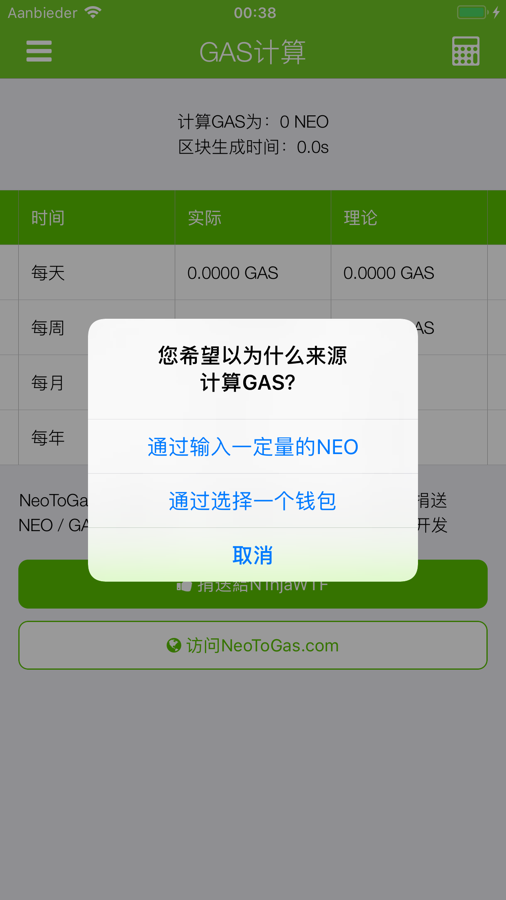
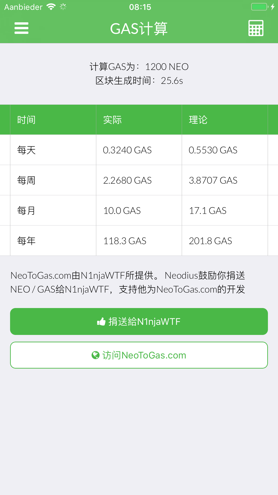
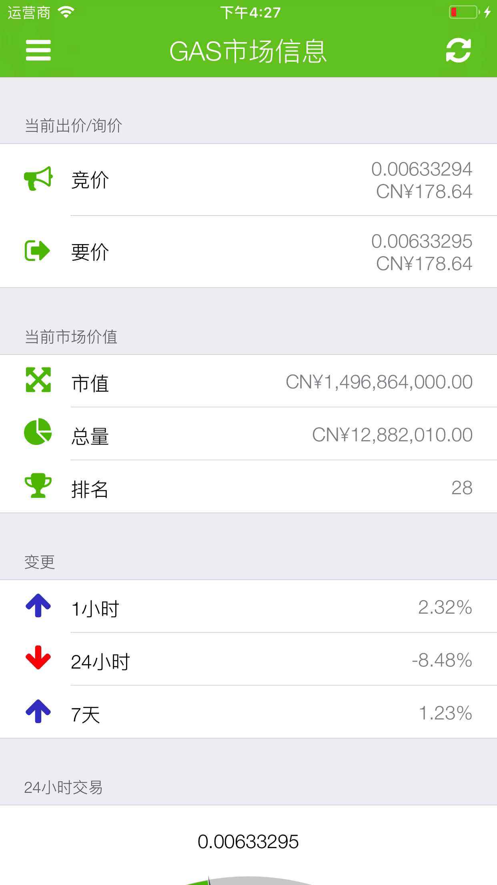
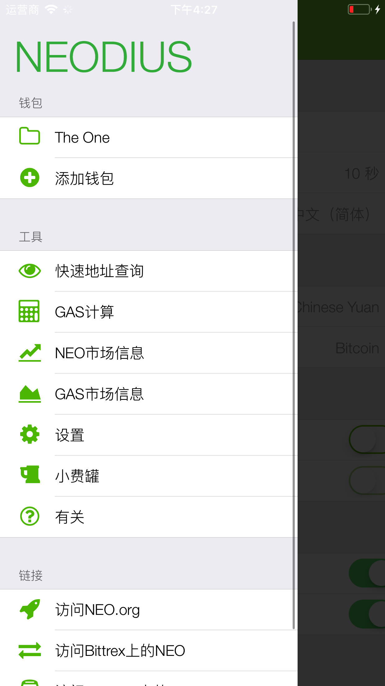
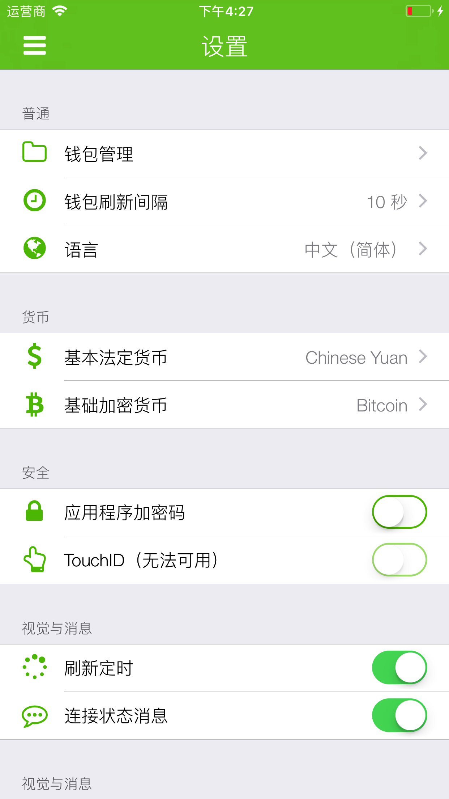
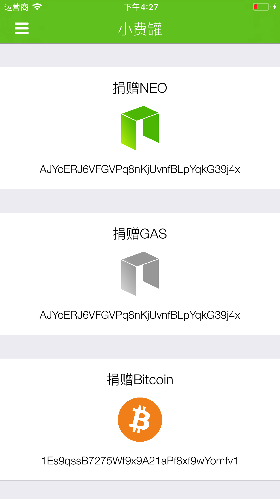
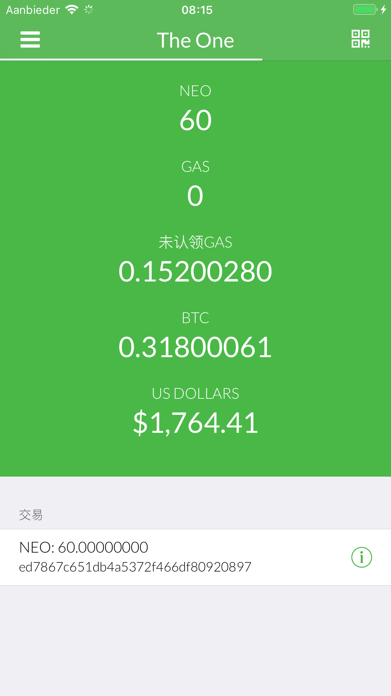

# 🇨🇳 Chinese (Simplified) (中文（简体）) screenshots

**Chinese (Simplified) is translated by: Yenct15**

[**View iPad screenshots**](../iPad/chinese-simplified-screenshots.md) | [**View iPhone X screenshots**](../iPhone+X/chinese-simplified-screenshots.md)

         