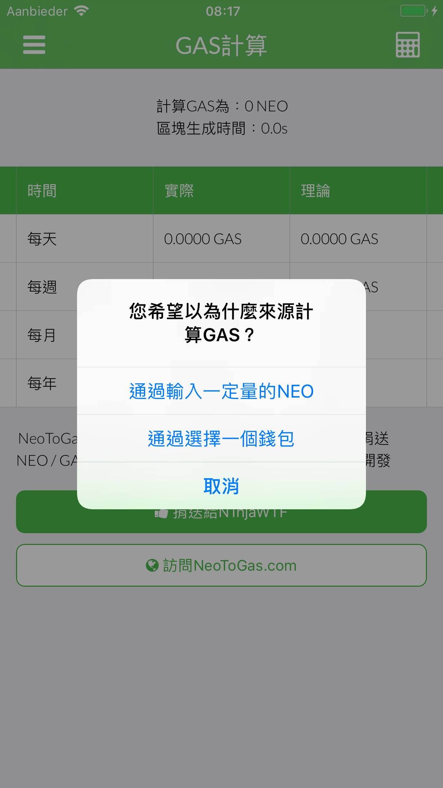
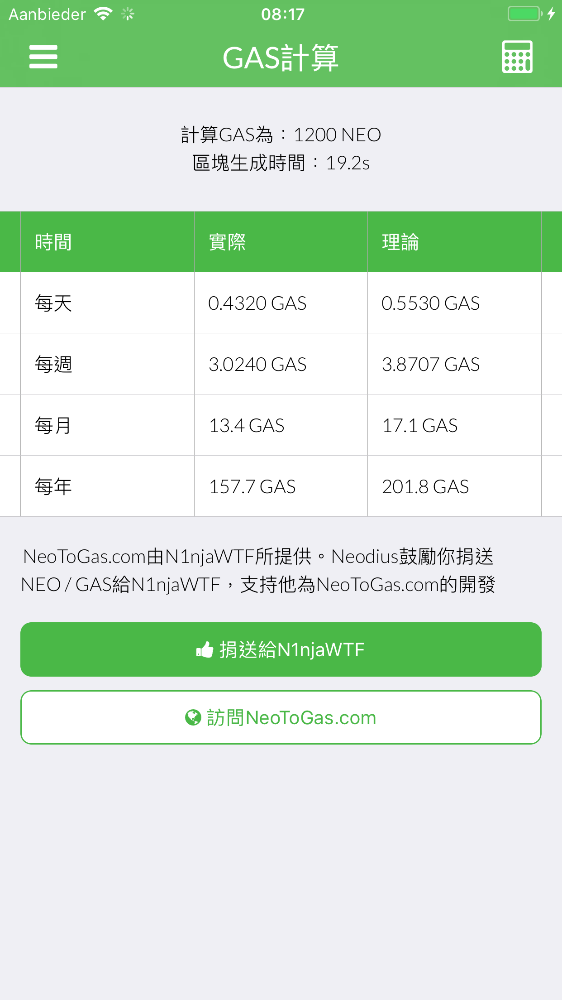
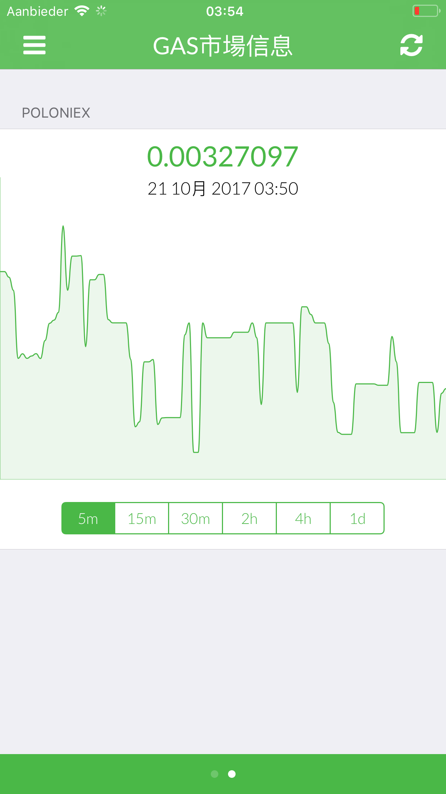
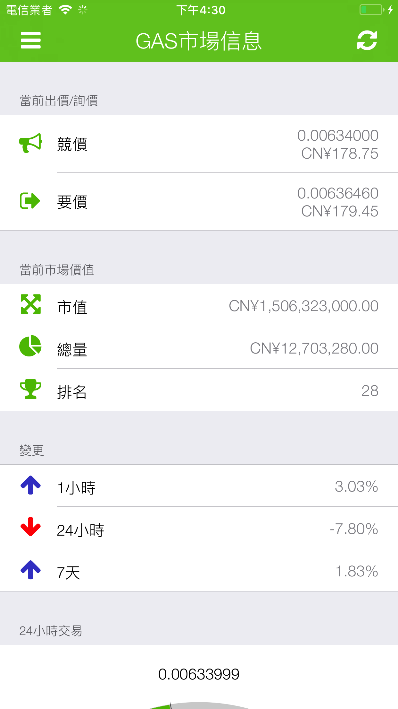
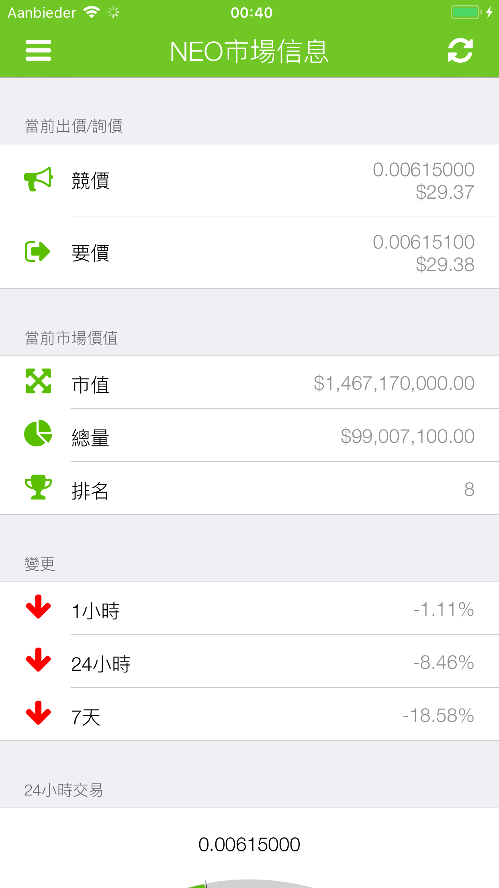
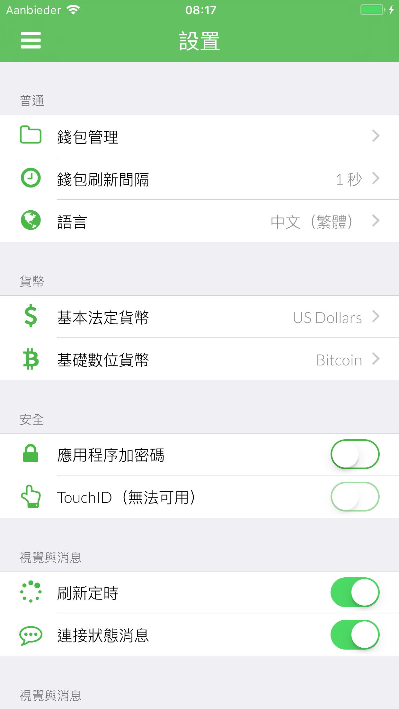
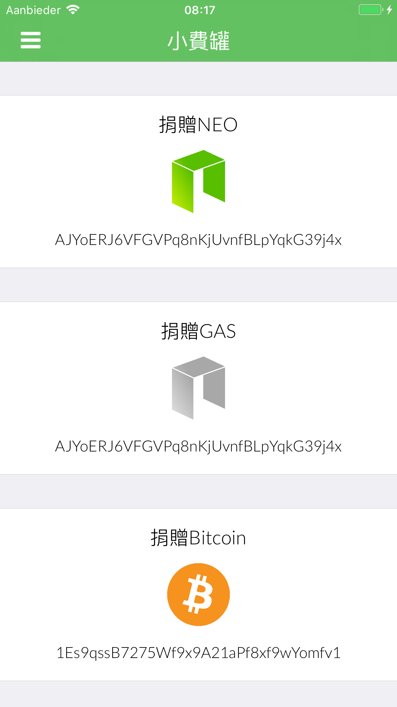
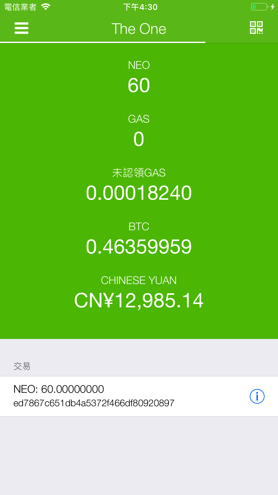

# 🇨🇳 Chinese (Traditional) (中文（繁體）) screenshots

**Chinese (Traditional) is translated by: Yenct15**

[**View iPad screenshots**](../iPad/chinese-traditional-screenshots.md) | [**View iPhone X screenshots**](../iPhone%20X/chinese-traditional-screenshots.md)

           