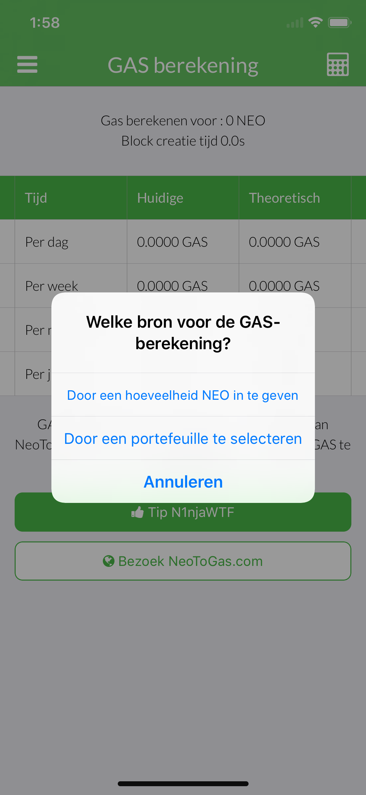
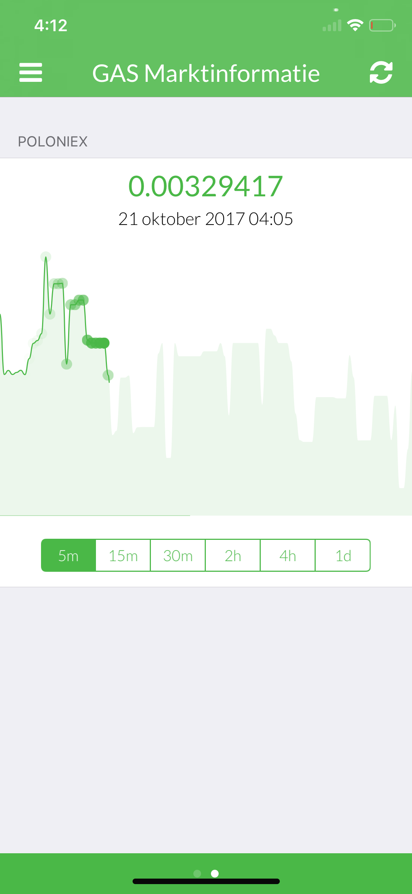
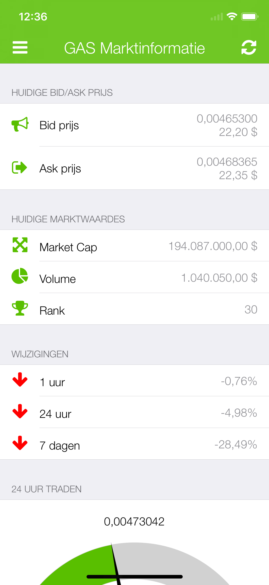
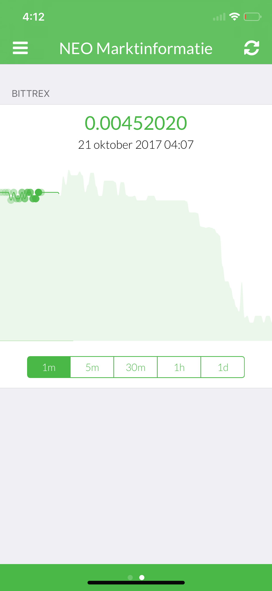
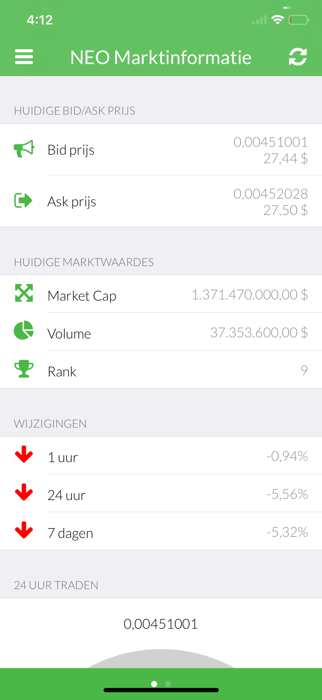
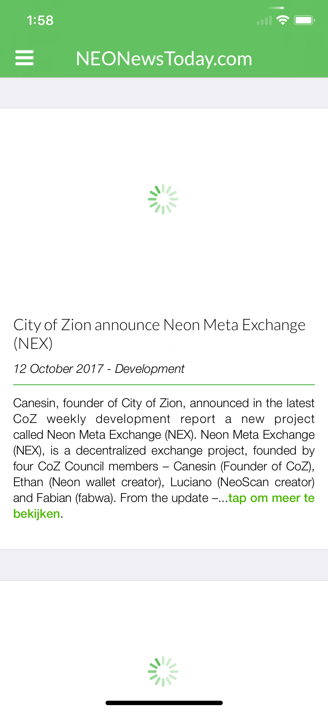
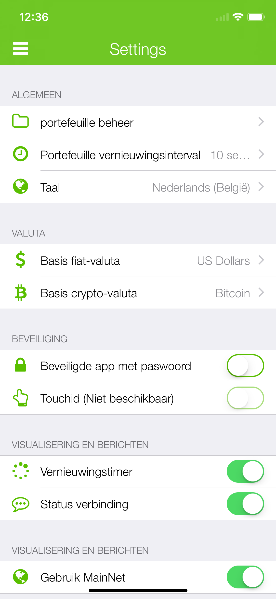
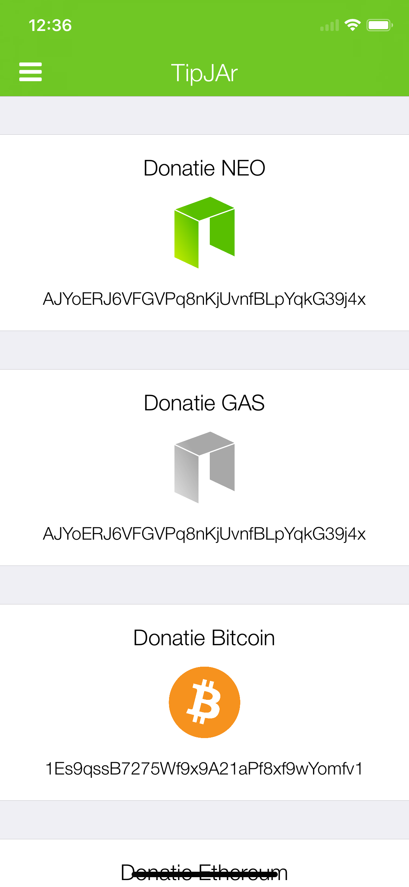
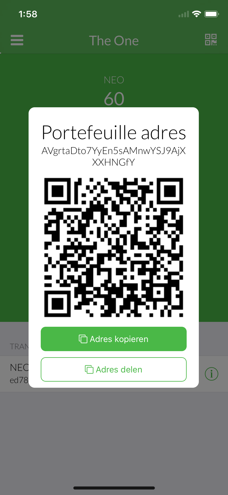
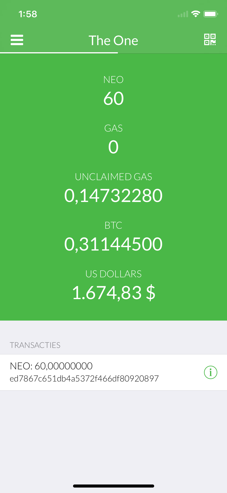

# 🇧🇪 Dutch (Belgium) (Nederlands (België)) screenshots

**Flemish is translated by: ManicPreacher**

[**View iPad screenshots**](../iPad/dutch-belgium-screenshots.md) | [**View iPhone screenshots**](../iPhone/dutch-belgium-screenshots.md)

           