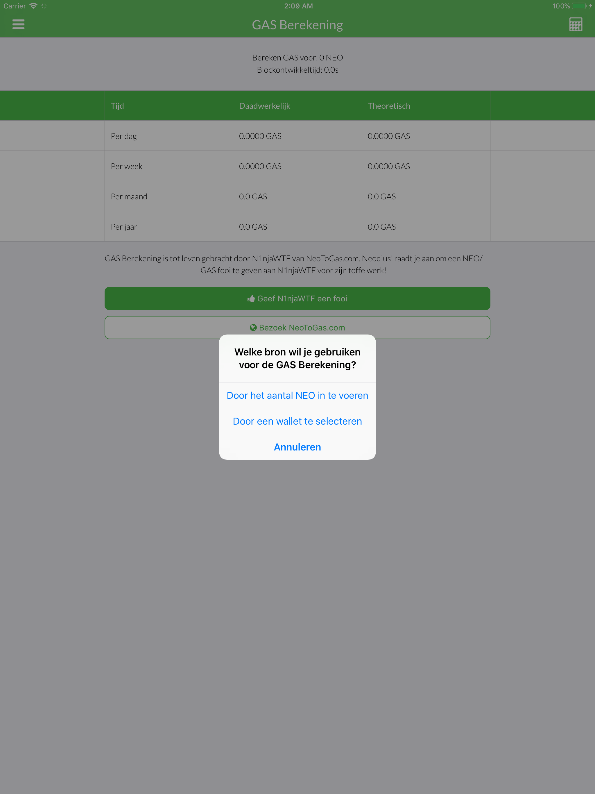
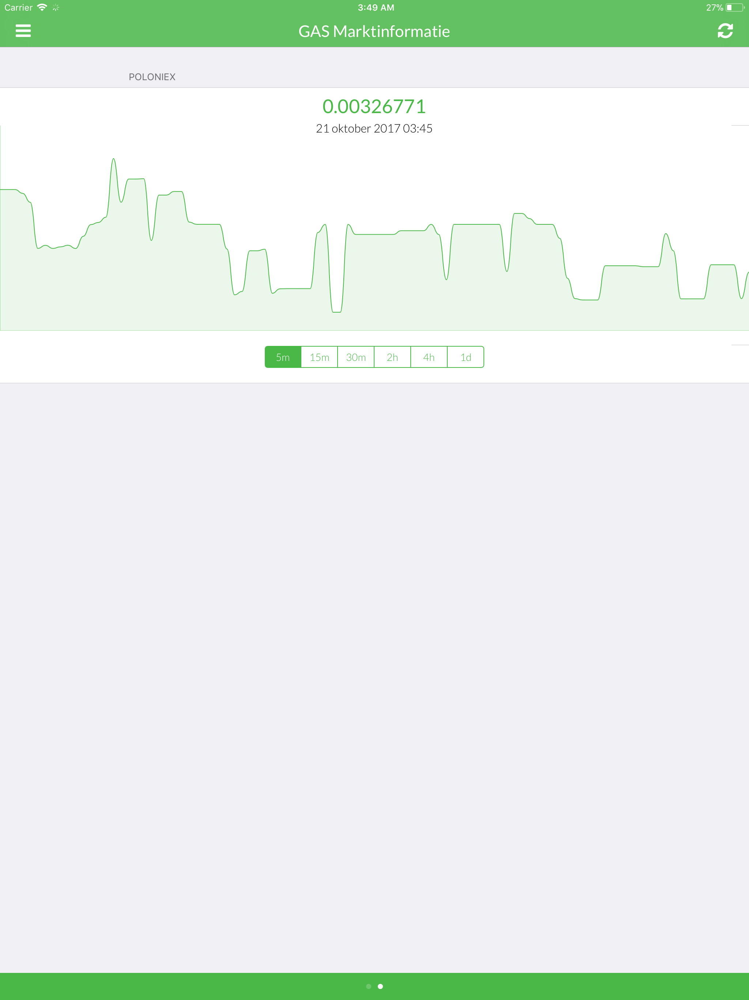
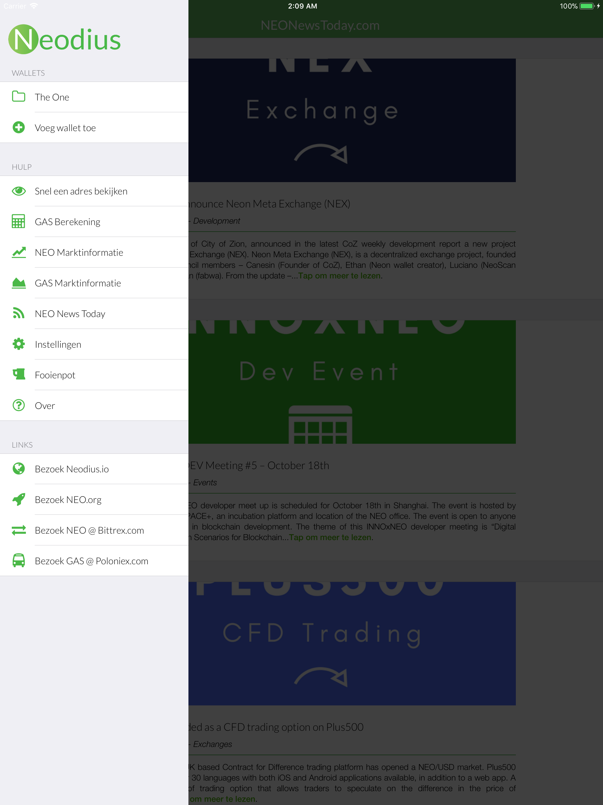
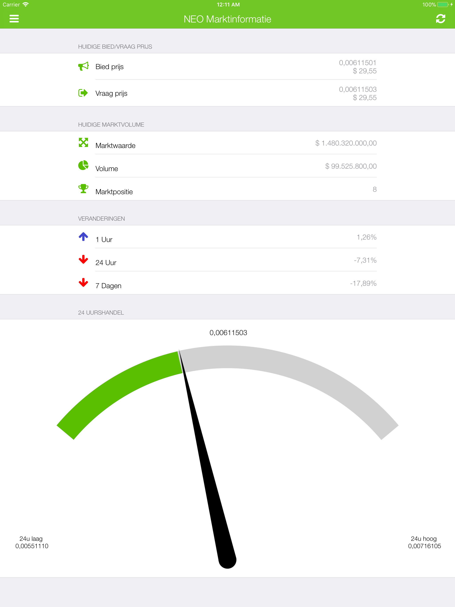
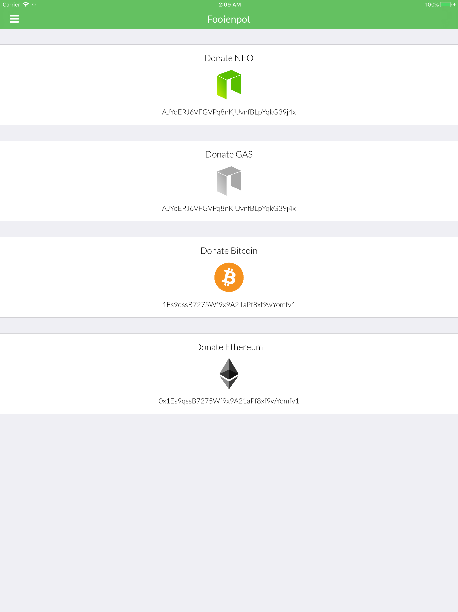
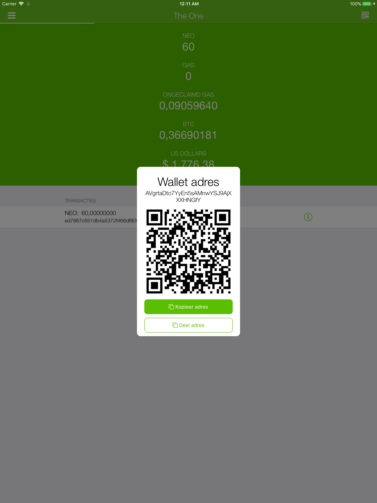

# 🇳🇱 Dutch (Nederlands) screenshots

**Dutch is translated by: Benjamin de Bos (info@its-vision.nl)**

[**View iPhone screenshots**](../iPhone/dutch-screenshots.md) | [**View iPhone X screenshots**](../iPhone%20X/dutch-screenshots.md)

           