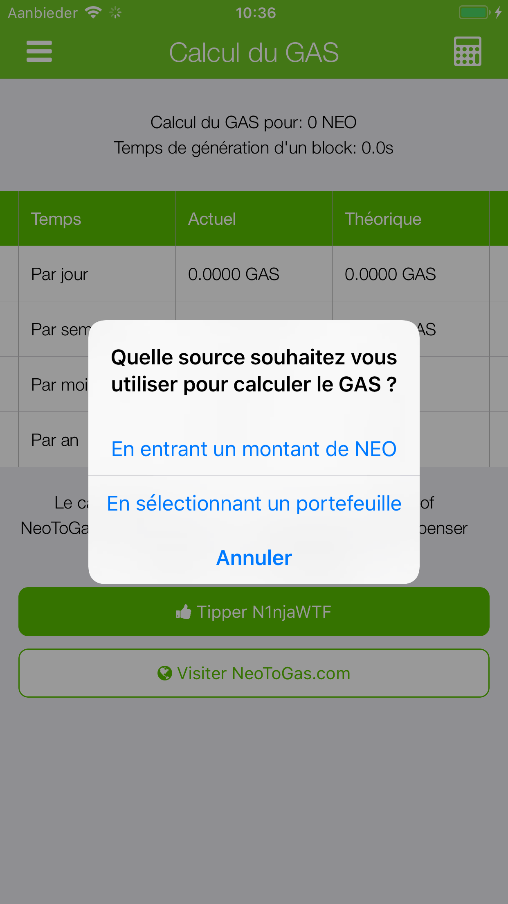
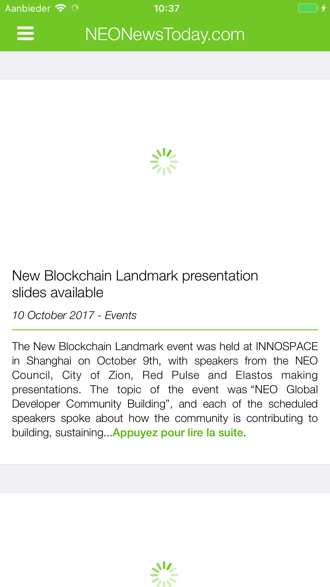

# 🇨🇦 French (Canada) (français (Canada)) screenshots

**French (Canadian) is translated by: mpeter**

[**View iPad screenshots**](../iPad/french-canada-screenshots.md) | [**View iPhone X screenshots**](../iPhone%20X/french-canada-screenshots.md)

           