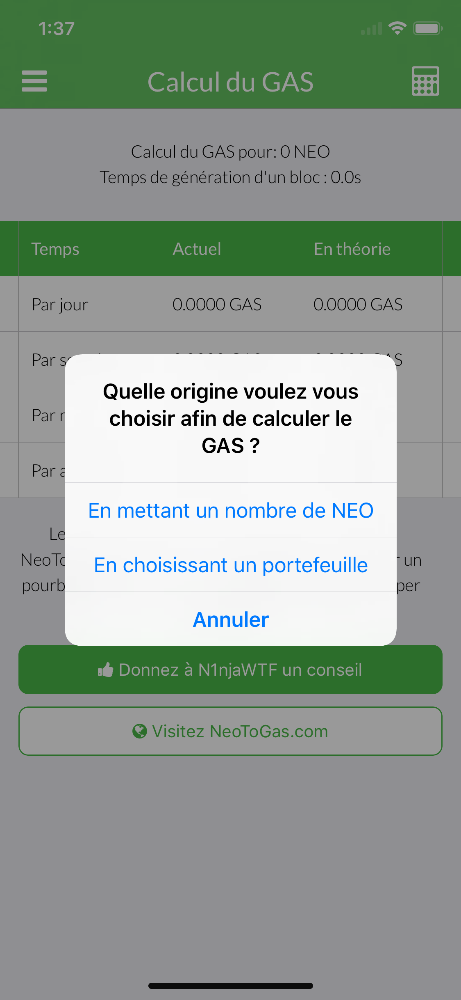
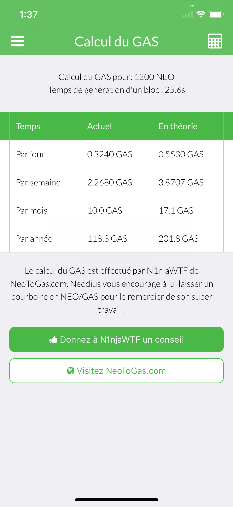
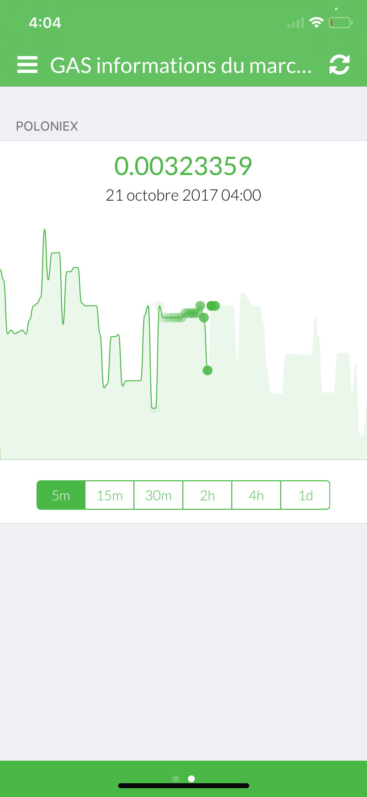
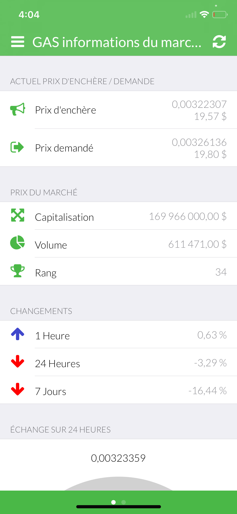
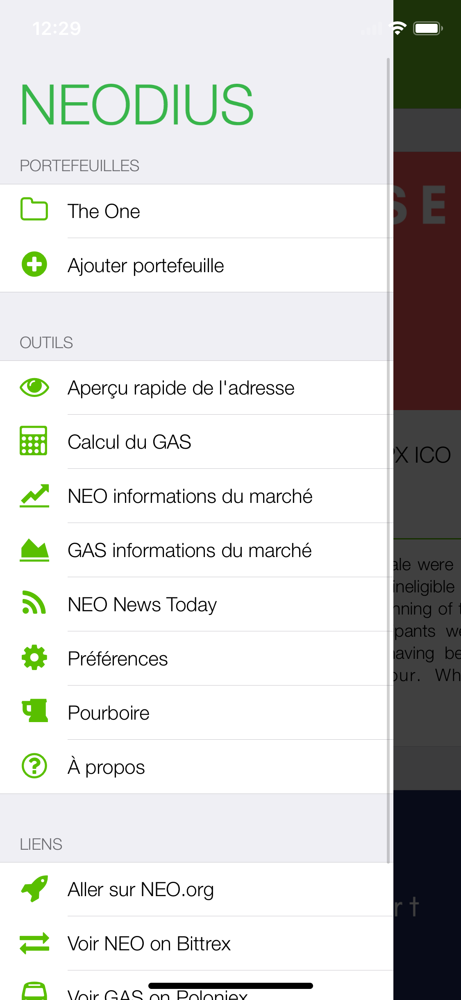
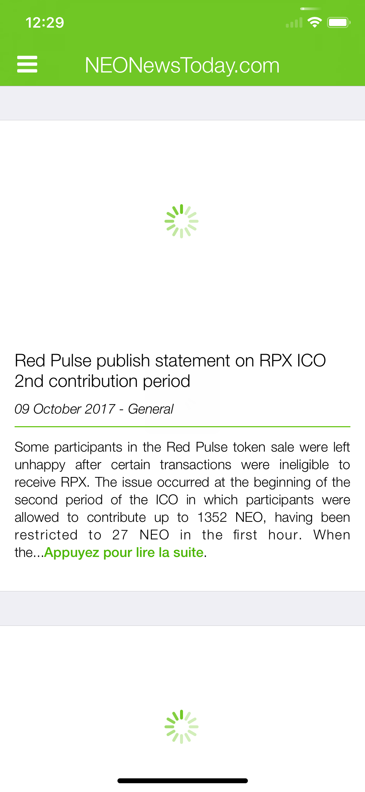
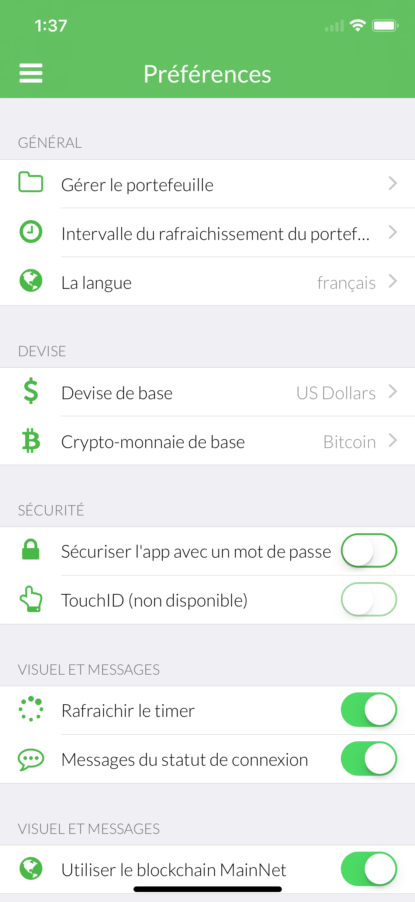

# 🇫🇷 French (français) screenshots

**French is translated by: Mati14**

[**View iPad screenshots**](../iPad/french-screenshots.md) | [**View iPhone screenshots**](../iPhone/french-screenshots.md)

           