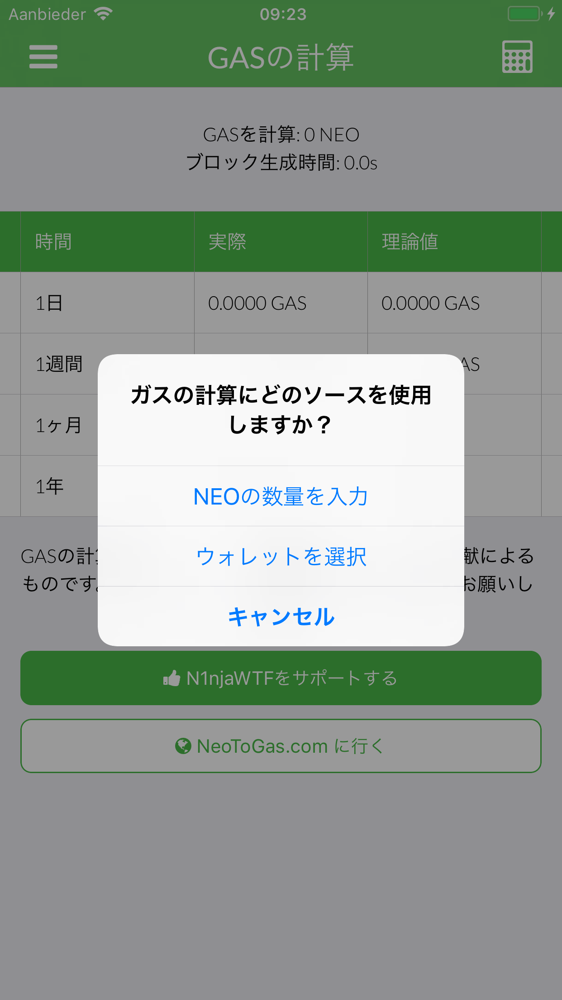
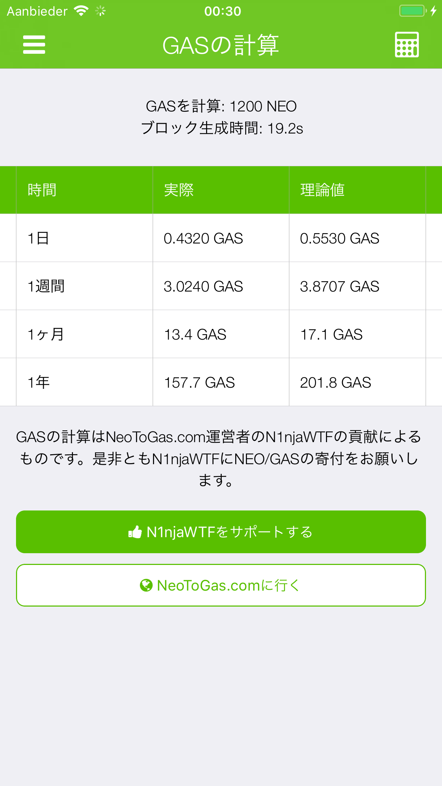
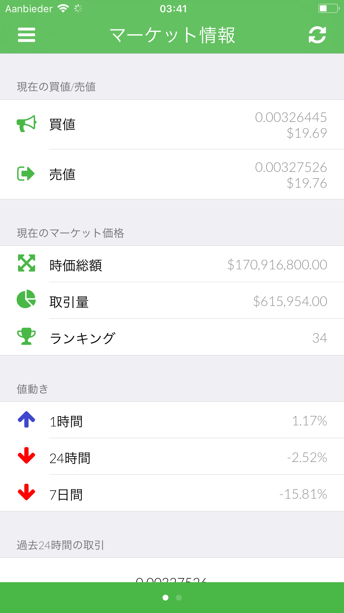
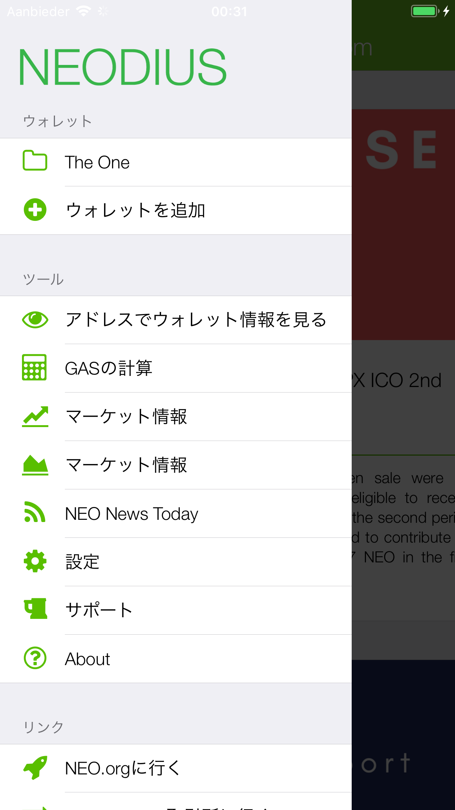
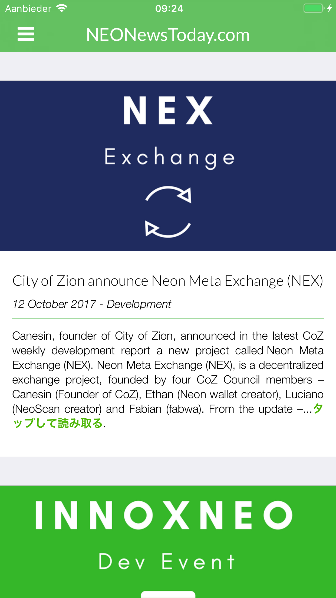
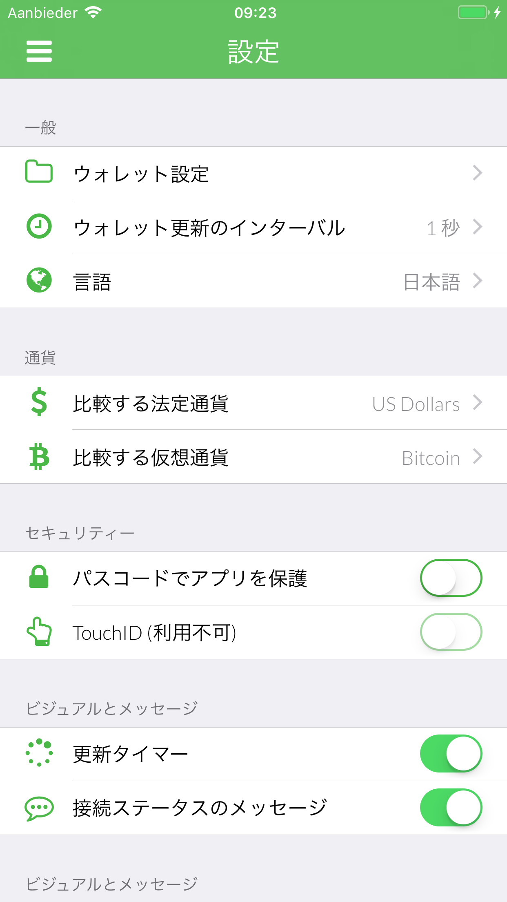
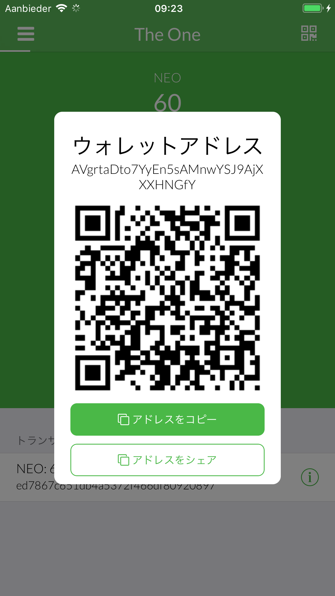
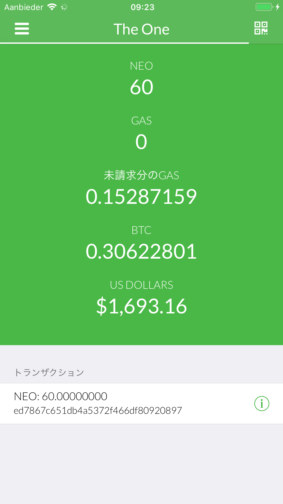

# 🇯🇵 Japanese (日本語) screenshots

**Japanese is translated by: neoojisan (https://twitter.com/neoojisan)**

[**View iPad screenshots**](../iPad/japanese-screenshots.md) | [**View iPhone X screenshots**](../iPhone+X/japanese-screenshots.md)

         