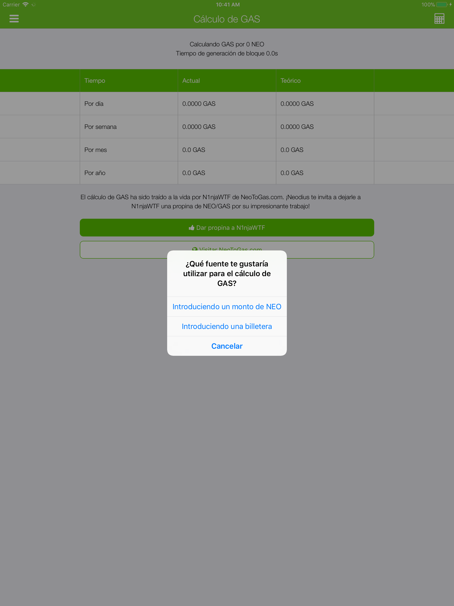
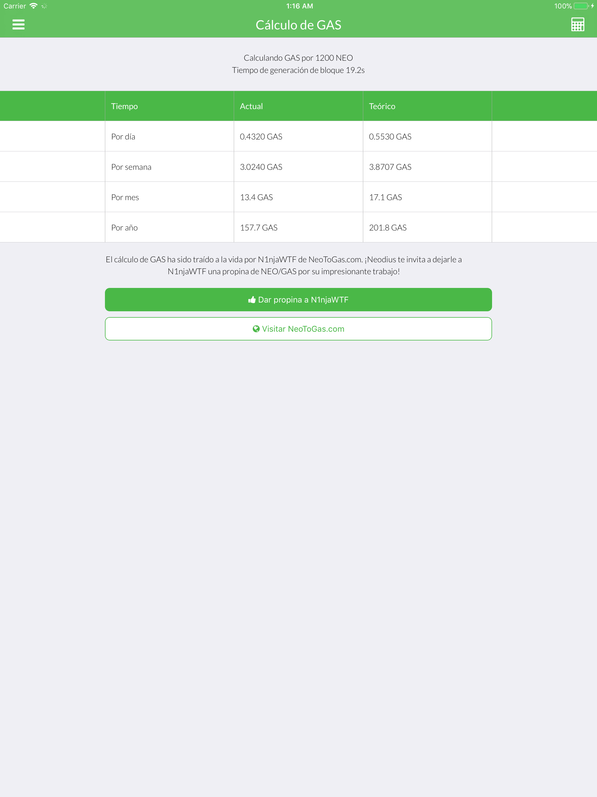
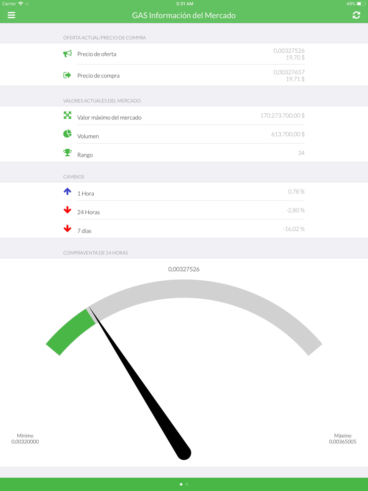
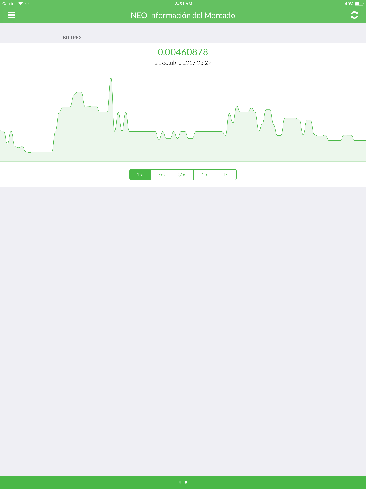
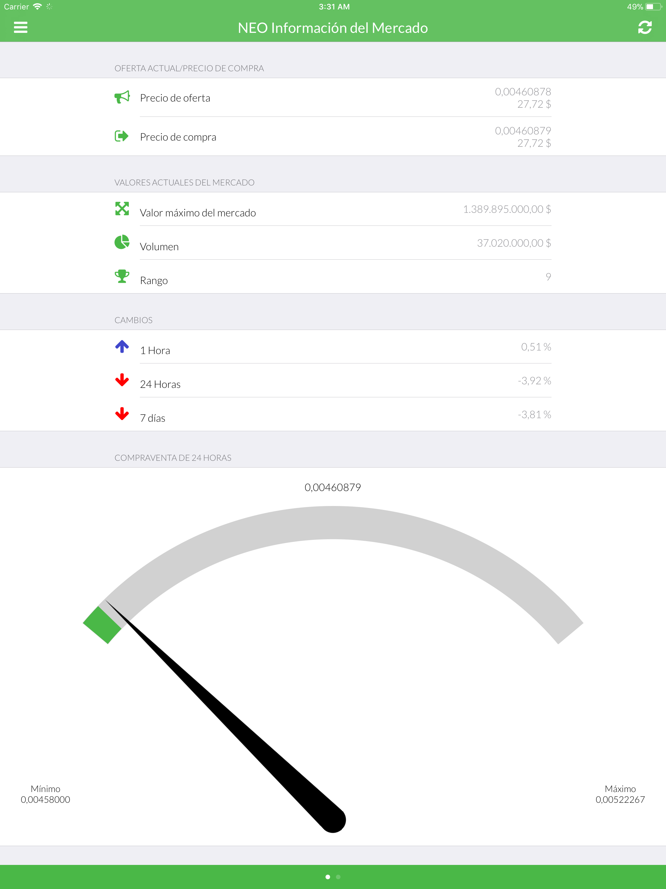
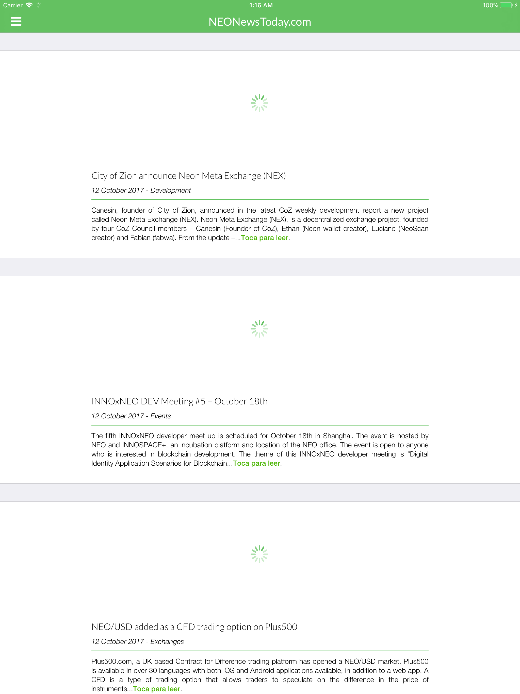
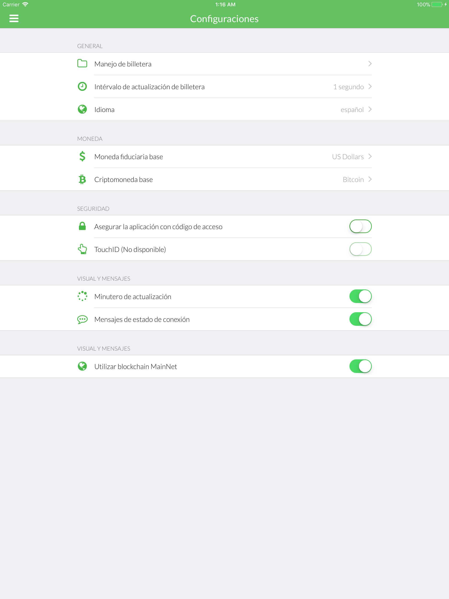
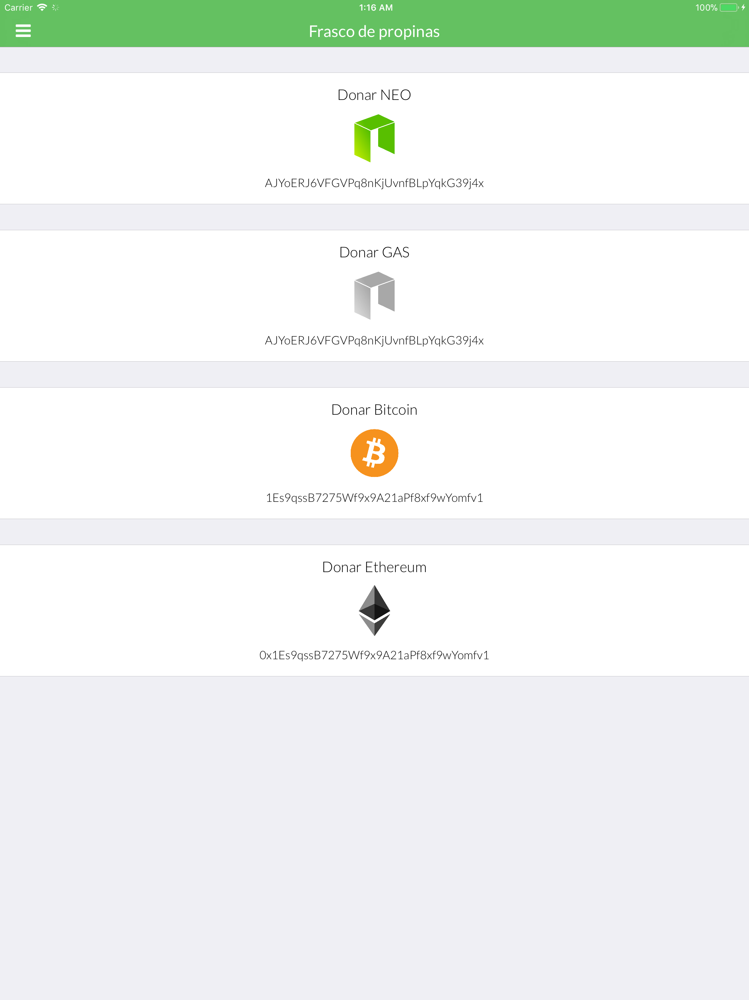

# 🇪🇸 Spanish (español) screenshots

**Spanish is translated by: aqdnk**

[**View iPhone screenshots**](../iPhone/spanish-screenshots.md) | [**View iPhone X screenshots**](../iPhone%20X/spanish-screenshots.md)

           