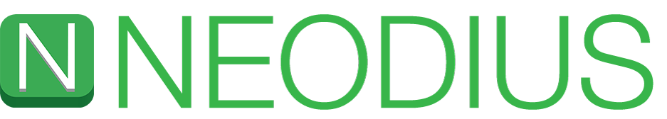

# Building Nodius
So you can't wait and want to build it yourself? Or you want to contribute to Nodius: You can! You actually don't need to be a rocket scientist (:rocket: to the moon). Follow these easy steps to get it running on your iDevice (or wait for the App Store approval).

1. Make sure you have Xcode installed: [https://developer.apple.com/xcode/]()
2. Start terminal
3. cd into your documents directory `cd ~/Documents/`
4. And enter `git clone https://github.com/ITSVision/Nodius.git`
5. Now cd into the Nodius dir: `cd Nodius`
6. If Cocoapods isn't installed (if you've never heard of it; it's not installed) install Cocoapods: `sudo gem install cocoapods`
7. Still in the `~/Documents/Nodius/` directory run `pod install`
8. Open `Nodius.xcworkspace`
9. Acknowledge all questions and thingys
10. Open Xode preferences (Xcode > Preferences…)
11. Click the ‘Accounts’ tab
12. Login with your Apple ID (+ > Add Apple ID…)
13. Close this screen
14. Click on Run ▶️-icon.
15. Go to the Project Editor by clicking the name or your project in the Project Navigator
16. Select the ‘General’ section if it isn’t already
17. Select the Personal Team you created earlier from the ‘Team’ dropdown in the ‘Signing’ section
18. Boom! It's running on your iPhone! :beer:

