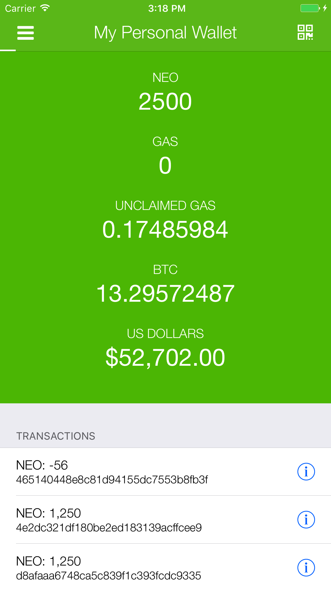
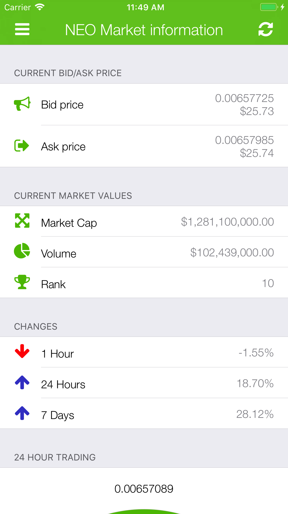
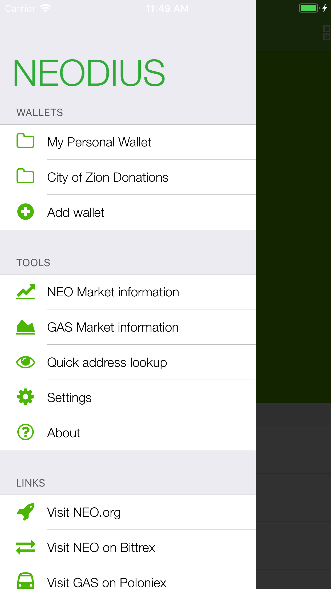
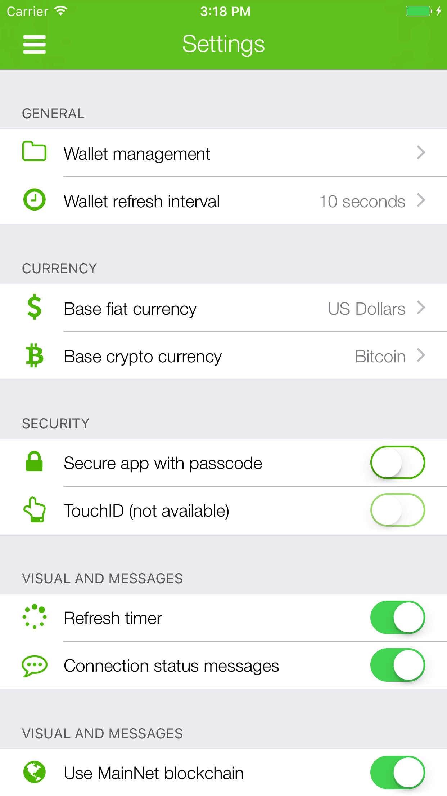

# Neodius

Neodius is a NEO blockchain tool. Neodius let's you easily view your balance in various ways based on your address. A must have for every NEO fan. Ofcourse poured in a pretty-and-easy iOS interface. It has been submitted to the Apple AppStore. So I'm waiting for approval. Once it's approved, the link will be available here.

    

## What's this NEO all about
NEO, formerly Antshares, is China's first ever open source blockchain. Founded in 2014, NEO’s mission has been to reinvent the way commerce is done. So basically it's just another improved Bitcoin rip-off. However, NEO has a lot of extra features which make it a good investment.

## But what does Neodius do?
Neodius was built with the idea to have a better insight into your Neo Crypto assets (love those hypie words :). Since NEO has that awesome GAS ([neotogas.com click on about](https://neotogas.com)), it's good to see how much you have and how much you can claim. But most importantly, you want to know how many beers you can buy with your NEO :beer:. So i have implemented an automatic conversion from NEO to a (realistic) fiat value.

## What are the features?
Probably the most important is:
Neodius is based on public address, no private keys needed. So no worries about your private key being abused when your iDevice is lost/abused.

Features currently are:
* Multi-wallet
* View your amount of NEO
* view your GAS
* View your unclaimed gas
* View NEO value in BTC/ETH
* View NEO value in fiat currencies ([View currencies](Neodius/Neodius/Supporting Files/SettingCache/fiatCurrencies.json))
* Automatic refreshing of your wallet. Fun for real-time stats
* Securing Neodius with a passcode or TouchID
* Quick address lookup
* Quick transaction lookup
* QRCode for your address.
* Switch between MainNet and TestNet
* Localization in
	* Dutch
	* English
	* More to come? (help us out here :kissing_heart: )
* View market information on GAS and NEO
	* Bid/ask prices
	* Current market (cap, volume, position)
	* Changes (1h, 24h, 7d)
	* Gauge showing current position on 24h tradingview
* Scanning QR-Codes to add a wallet
* GAS Calculation from a wallet or a user decided amount
* More to come! :)

## Looks awesome, but how can i use it.
### The AppStore
As stated above; it's currently being approved for the App Store where you'll soon be able to download it for free. However; since i believe in the power of open-source; it's here so everyone can use, edit and contribute to it.

**I will post the AppStore link here and on [Reddit](https://www.reddit.com/r/NEO/) when it's approved!**

### Building it yourself
So you want to build it to your iDevice yourself? We have a beautiful markdown for that: [Check this out](BUILD.md).

## Credit where credits due
We're making use of the API's of the awesome City of Zion developers community. These guys are making everyones NEO life a lot better. Check them out at [www.cityofzion.io]() and don't for get to donate some NEO at: `Adr3XjZ5QDzVJrWvzmsTTchpLRRGSzgS5A`.

## I want to help!
You can! I'll reward you with a lot of hugs :-) Send me a message or do a pull request.

## That's it
I put a few days of effort in this app and i'd love to hear your reaction about it. Feel free to contribute and suggest stuff.

## Where can i pay?
You don't need to pay for this, but it's on GitHub so you probably knew that :-)  However if you want to donate: Click the button below:

You can always send me some cryptos

* NEO: `AJYoERJ6VFGVPq8nKjUvnfBLpYqkG39j4x`
* BTC: `1Es9qssB7275Wf9x9A21aPf8xf9wYomfv1`
* ETH: `0x442a0092725a7c6c17938605c76c4c1d2b8bb4c1`

## Authors/Contributors
The authors working on this project:

* **Benjamin de Bos**
* **[@N1njaWTF](http://twitter.com/N1njaWTF)** of (NeoToGas.com) for the GAS Calculation logic

See also the list of [contributors](contributors) who participated in this project.

## License

This project is licensed under the MIT License - see the [LICENSE.md](LICENSE.md) file for details. Enjoy the code and see you in Zion.
